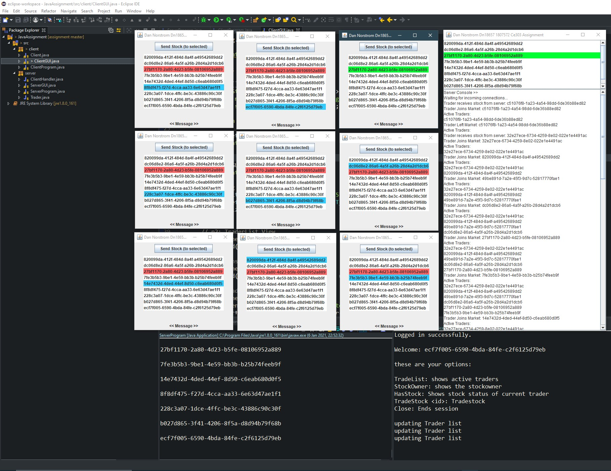

Creator: Dan Norstrom, dn18657, 1807572, NORST42202  
Course: CE303 Advanced Programming  
Related to: Assignment  
Date: 2020-12-01  
  
C# Client:
	Project Folder: CClient

	Main class: 	ClientProgram.cs

	Depends on: 	Java/C# server.

	Start method: 	Execute as "dotnet run" in local folder, from CMD or IDE.
			Take note of <StartupObject>CClient.ClientProgram</StartupObject>
			In the CClient.csproj to acertain correct startup file.
			
	Effect: Client runs responses and commands from CMD/IDE-console.

	Usage:	When engaged the clients prints all commands available to the trader
		in CMD. The Trader may use these commands to communicate with the server.

	Developed with:	MVC using DotNet version 3.1.403

C# Server:
	Project Folder: CServer

	Main class: 	ServerProgram.cs

	Start method: 	Execute as "dotnet run" in local folder, from CMD or IDE.
			Take note of <StartupObject>CServer.ServerProgram</StartupObject>
			in the CServer.csproj to acertain correct startup file.

	Effect: Server runs and shows Events in CMD/IDE-console.

	Usage:	There is no direct interaction with the server trough CMD/IDE-console.
		It simply shows the required events. (for some reasons this might be named
		"BankServer" in INtelliJ, im not sure why, but its probablly bc i reused
		folders from this courses labs.

	Developed with:	MVC using DotNet version 3.1.403

Java Client:
	Project Folder: JavaAssignment/src/

	Package: 	client

	Main class: 	ClientProgram.java

	Depends on: 	Java/C# server.

	Start method: 	Execute as java application from CMD or IDE.

	Effect:		This Brings up the GUI that communicates with the server

	Usage: 	While Current client owns stock (Green list-status)
		The client may mark another client in the list by clicking on them
		When a client is marked the current client may send its stock by clicking
		the "send stock" button.
		a server/client repsonse message is showed at the bottom of every client.

	List-status:	Green: The current Client has stock.
			Blue: The current Client.
			Red: Client with Stock.

	Developed with:	Eclipse using Java - JRE System Library [jre1.8.0_161]
			

Java Server:
	Project Folder: JavaAssignment/src

	Package: 	server

	Main Class: 	ServerProgram.java

	Start method: 	Execute as java application from CMD or IDE.

	Effect: 	This brings up the Server GUI, showing all connected traders.

	Usage: 	At the top of the gui all the active traders are showcased.
		Green status is active Trader with stock.
		At the bottom the server console shows the required events and exceptions.

	Developed with:	Eclipse using Java - JRE System Library [jre1.8.0_161]
